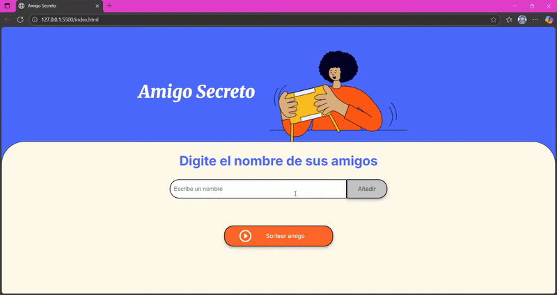

Funcionalidades

1. Agregar amigos: Permite ingresar los nombres de los participantes a la lista.

2. Mostrar lista: Muestra dinámicamente la lista de nombres agregados.

3. Sorteo de amigo secreto: Selecciona un nombre aleatorio de la lista con un efecto visual antes de mostrar al ganador.

4. Reinicio automático: Después de realizar el sorteo, la lista de participantes se vacía automáticamente para poder hacer un nuevo sorteo.

Tecnologías utilizadas

La base de este proyecto fue proporcionada por ALURA, lo hicieron con el proposito de concentrarnos en el codigo para aplicar lo que aprendimos en distintos cursos.

1. HTML: Estructura de la página y elementos interactivos.

2. CSS: Estilos y colores de la interfaz.

3. JavaScript: Lógica para agregar participantes, mostrar la lista y realizar el sorteo aleatorio.

Cómo usar

1. Abrir el archivo index.html en tu navegador.

2. Escribir el nombre de un participante en el campo de texto y presionar el botón Agregar.

3. Repetir el paso 2 hasta que todos los participantes estén en la lista.

4. Presionar el botón Sortear Amigo para seleccionar al ganador de manera aleatoria.

5. El ganador aparecerá en la sección de resultados con un mensaje destacado.
